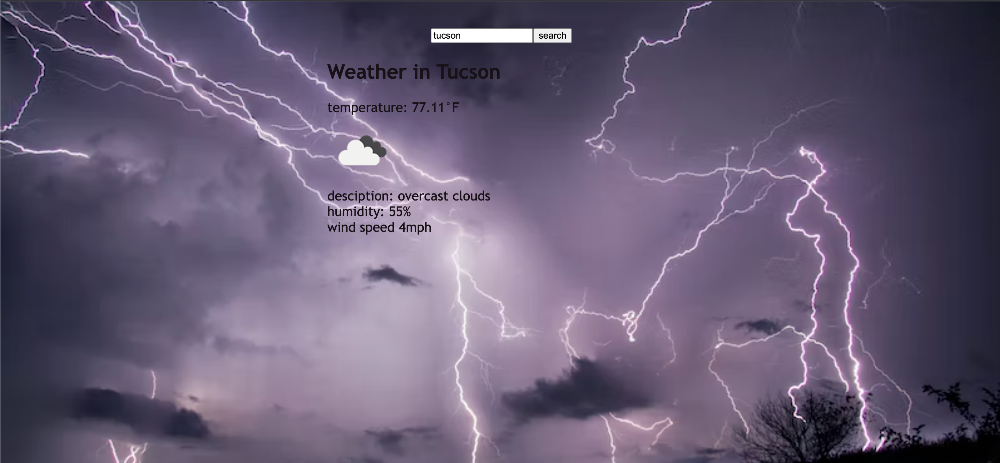

# weatherDashboard
This application allows you to instantly find the current weather of whatever city of interest. Upon searching you will find the current weather, a description, humidy, windspeed and an icon.
### License:
NA
### Intallation:
to install the dependencies open the terminal and run:
no installations needed
### Usage:
To find the weather of any city, type the city into the search box and click the search button. 
### Contributors:
na
### screenshot:

### Links
[github](https://github.com/mmontoya1112/weatherDashboard)